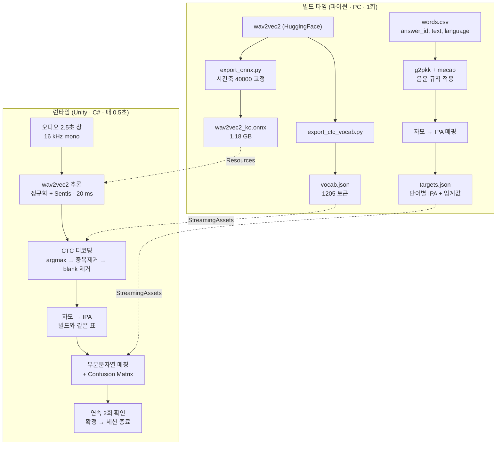

# 아동 발음 판정 시스템 — 종합 보고서

VR 발음 훈련 앱에 넣을 **발음 판정 엔진**을 만들었습니다. 파이썬 프로토타입에서
출발해 Unity 패키지(`com.domicube.phoneme-matching` v0.4.0)까지 왔고, 지금은
Unity 2022.3 과 Unity 6 양쪽에서 실제 마이크 발화를 확정시킬 수 있습니다.

- 저장소: <https://github.com/rnrdus5642/Audio-Recognition>
- 작성 시점: 2026-08-11 · 커밋 `00d85f9` · 태그 `v0.4.0`
- 운영 문서: [패키지 README](unity/Packages/com.domicube.phoneme-matching/README.md) (설치·사용법·API)

---

## 1. 무엇을 푸는 문제인가

아이가 화면에 뜬 단어를 **말했는지 아닌지**를 판정해야 합니다. 겉보기엔
음성 인식이지만, 일반적인 STT 를 그대로 쓰면 두 가지가 무너집니다.

**환각.** STT 는 무슨 소리든 그럴듯한 문장으로 만들어 냅니다. 아이가 어물거리면
"사과했어요" 같은 걸 내놓고, 문자열 비교는 이걸 오답으로 처리합니다. 반대로
전혀 다른 말을 했는데 정답 단어가 섞여 나오기도 합니다.

**부정확한 발음.** 타겟 사용자는 아동이고 발달지연도 포함합니다. "사과"가
"타과"로, "토끼"가 "도끼"로 나오는 게 정상입니다. 글자가 틀렸다고 틀린 게
아닙니다.

그래서 **글자가 아니라 음소(IPA)를 비교**하고, **완전 일치가 아니라 부분 일치에
가중치를 매겨** 판정합니다. 아이가 낼 법한 오류는 싸게, 낼 리 없는 오류는 비싸게
계산합니다.

---

## 2. 파이프라인

두 갈래입니다. **빌드 타임**은 PC 에서 한 번 돌려 데이터를 만들고,
**런타임**은 VR 앱 안에서 0.5 초마다 돕니다. 앱에는 파이썬도 서버도 들어가지
않습니다.



### 빌드 타임 — 5 단계

| # | 단계 | 하는 일 |
|---|---|---|
| 1 | words.csv | 정답 단어를 글자로 적어둠 |
| 2 | g2pkk | 음운 규칙을 적용해 소리 나는 대로 바꿈 (`먹어요` → `머거요`) |
| 3 | targets.json | 자모를 IPA 로 바꾸고 단어별 임계값과 함께 저장 |
| 4 | ONNX export | wav2vec2 를 시간축 40000 고정으로 변환 |
| 5 | vocab export | 번호 ↔ 글자 대응표와 전처리 설정을 추출 |

### 런타임 — 6 단계

| # | 단계 | 하는 일 |
|---|---|---|
| 1 | 오디오 2.5초 창 | 최근 2.5 초를 16 kHz 모노로 들고 있다가 40000 샘플을 통째로 넘김 |
| 2 | wav2vec2 추론 | 볼륨을 정규화해 모델에 넣고 124 프레임 × 1205 글자 점수를 받음 (GPU 20 ms) |
| 3 | CTC 디코딩 | 프레임마다 최고점을 골라 중복과 blank 를 걷어내고 한글로 되돌림 |
| 4 | 자모 → IPA | 인식된 한글을 정답과 같은 표로 음소 기호로 바꿈 |
| 5 | 부분문자열 매칭 | 정답 음소가 가장 잘 맞는 구간을 찾아 confusion matrix 가중치로 점수를 냄 |
| 6 | 연속 2회 확인 | 같은 단어가 두 프레임 연속 통과하면 확정하고 세션을 닫음 |

핵심은 빌드 3 단계와 런타임 4 단계가 **같은 매핑 테이블**을 지난다는 점입니다.
정답 측과 사용자 측이 같은 IPA 표기 체계로 떨어지지 않으면 거리 계산이 의미가
없습니다.

### 왜 빌드 타임과 런타임을 갈랐나

한국어 G2P 는 음운 규칙(연음·경음화·비음화)이 필요하고 그건 형태소 분석기를
씁니다 — 파이썬 의존성 덩어리입니다. 이걸 런타임에 넣을 수 없어 **미리
돌려놓고 결과만 JSON 으로 넘깁니다.**

실제로 얼마나 손해인지 재봤습니다. 런타임의 자모→IPA 만으로 18단어를 변환해
빌드 결과와 비교하니 **3/18 만 달랐고**, 다른 3개도 규칙 적용 전후의 차이지
표기 체계가 어긋난 건 아니었습니다. 즉 사용자 발화 쪽은 규칙 없이 처리해도
매칭에 지장이 없고, **정답 쪽만 정확하면 됩니다.** 그래서 정답 쪽은 빌드
타임에 전체 규칙을 먹입니다.

---

## 3. 사용한 기술

| 층 | 선택 | 이유 |
|---|---|---|
| 음향 모델 | `kresnik/wav2vec2-large-xlsr-korean` (300M) | 음소 단위 CTC 출력. 언어모델이 없어 환각이 없다 |
| 추론 | ONNX opset 18 → Unity Sentis / Inference Engine | 서버·파이썬 없이 앱 안에서 실행 |
| 디코딩 | greedy CTC (직접 구현) | argmax → 중복 제거 → blank 제거. 파이썬 `batch_decode` 와 43케이스 대조 |
| 빌드 G2P | g2pkk + eunjeon(mecab) | 한국어 음운 규칙 |
| 매칭 | 가중 부분문자열 편집거리 + Confusion Matrix | 아래 참조 |
| 안정화 | 롤링 창 2.5초 / hop 0.5초 / 연속 2회 확인 | 프레임 단위 오발동 억제 |
| 배포 | UPM 패키지 (git URL) | 팀의 다른 Unity 프로젝트에서 한 줄로 설치 |

### 3.1 매칭 알고리즘

출발점은 편집 거리입니다 — 두 음소 배열을 같게 만드는 최소 비용이고, 삽입·삭제·
치환이 각각 1 점, 전체를 전체와 비교합니다. 이걸 그대로 쓰면 아이 발화에는
맞지 않아서 **거리 계산에서 세 군데를 바꿨습니다.**

아래 숫자는 정답 `사과` `[s,a,k,w,a]` 에 대해 실제로 뽑은 값입니다.

#### (1) 치환 비용을 음소쌍마다 다르게 — Confusion Matrix

기본 편집 거리는 `ㅅ` 을 `ㄷ` 으로 바꾸든 `ㅁ` 으로 바꾸든 똑같이 1 점입니다.
아이가 낼 법한 오류는 싸게, 낼 리 없는 오류는 비싸게 매깁니다.

| 패턴 | 비용 | 예 |
|---|---|---|
| 평음/격음/경음 교체 | ~0.2 | `k` ↔ `kʰ` |
| 발달지연 미숙 (/ㅅ/→/ㄷ/, /ㄹ/→/ㄷ/) | ~0.3 | `s` ↔ `t` |
| 종성 불파음 ↔ 동가 초성 | ~0.15–0.2 | `k̚` ↔ `k` |
| 모음 인접 | ~0.3–0.5 | `a` ↔ `o` |
| 종성 탈락 (삭제) | ~0.3 | 책 → 채 |
| 그 밖의 치환 (기본) | 0.8 | `l` ↔ `t` |

```
사과 → 타과   [t,a,k,w,a]     거리 0.30   점수 0.940
사과 → 차과   [tɕʰ,a,k,w,a]   거리 0.75   점수 0.850
```

같은 첫 글자 오류인데 `타과` 는 살려주고 `차과` 는 깎습니다.

#### (2) 전체 대신 가장 잘 맞는 구간만 — 부분문자열 매칭

배열 전체를 비교하면 "음... 사과!" 의 앞부분이 전부 삽입 비용으로 잡혀 점수가
무너집니다. 그래서 **정답이 가장 잘 들어맞는 구간(창)** 을 찾고, 창 밖 음소는
1 개당 `skip_cost` 만 물립니다.

```
사과 → [ɯ,m,h, s,a,k,w,a]   거리 0.45   점수 0.910   창 [3:8]
         └ 창 밖 3개 ┘
```

> `skip_cost` 를 0 으로 두면 창 밖이 공짜가 되어, 점수가 발화 길이에 대해
> **단조 비감소**가 됩니다. 말을 길게 할수록 후보 창만 늘어나 어떤 임계값도
> 결국 넘습니다 — 실측으로 48음소짜리 무관한 잡담이 "가요" 에 0.950 을 받았습니다.
> 임계값으로는 막을 수 없어서 이 비용을 도입했습니다.
> 회귀 테스트: `TestSubstringFalseAccept`

#### (3) 창이 너무 짧으면 감점 — 커버리지 페널티

(2) 의 부작용입니다. `사` 만 말해도 창을 `[0:2]` 로 잡으면 그 안은 완전 일치라
점수가 높게 나옵니다. 종성 탈락을 봐주려고 삭제 비용을 싸게 잡아둔 것도 이걸
부추깁니다. 창 길이가 정답 길이의 커버리지 비율에 못 미치면 그만큼 곱해서
깎습니다.

```csharp
if (windowLen < Coverage * targetLen)
    baseScore *= windowLen / (double)targetLen / Coverage;
```

```
사과 → [s,a]   점수 0.544   창 [0:2]   ← 2/5 로 감점
```

#### 판정은 별개 단계입니다

여기까지가 거리 계산이고, 통과 여부는 그 다음에 정합니다.

```
점수 = 1 − 거리 ÷ 정답 음소 수     (커버리지 감점 적용)
통과 = 점수 ≥ 그 단어의 임계값
```

**임계값은 단어마다 다릅니다.** 짧은 단어는 우연히 맞을 확률이 높아 더
엄격합니다. 빌드 타임에 음소 수로 자동 결정됩니다.

| 정답 음소 수 | 1–2 | 3 | 4 | 5–6 | 7+ |
|---|---|---|---|---|---|
| 임계값 | 0.85 | 0.73 | 0.70 | 0.65 | 0.60 |

`사과` 는 5 음소라 0.65 입니다. 위 예시로는 `타과`·`차과`·`잡음+사과` 가 통과하고
`사` 만은 탈락합니다.

#### 스트리밍에만 하나 더 — 문맥 제한

채점 **직전에** 사용자 음소 배열을 최근 `4 × 정답음소수 + 3` 개로 잘라냅니다.
거리 계산을 바꾸는 게 아니라 입력을 줄이는 것이라 위 셋과 성격이 다릅니다.
계속 말하면 배열이 무한정 길어지고, 그 안 어딘가에서 정답과 우연히 맞는 구간이
반드시 생기기 때문입니다. 자세한 값은 3.2 참조.

### 3.2 연속 청취

VR 흐름은 마이크를 열어두고 정답이 들리면 즉시 넘어갑니다. 녹음 하나를
채점하는 것과 **다른 문제**라 설정을 분리했습니다.

| | 배치 (웹 UI·CLI) | 스트리밍 (VR) |
|---|---|---|
| `skip_cost` | 0.15 | 0.05 |
| 창 커버리지 하한 | 0.5 | 0.8 |
| 문맥 제한 | 없음 | 최근 `4×정답음소수+3` |
| 연속 확인 | 없음 | 2회 |

**하나로 통일할 수 없습니다.** 배치 설정을 스트리밍에 쓰면 검출이 1/4 로
떨어지고, 스트리밍 설정을 배치에 쓰면 positives 가 69.4% → 47.2% 로 무너집니다
(커버리지 0.8 이 "아빠 → 앞" 같은 의도된 관용을 죽입니다).

**청크를 이어붙이면 안 됩니다.** wav2vec2 는 문맥 모델이라 짧은 조각을 따로
인식해 합치면 뭉개집니다 — 4.4초 발화에서 0.5초 청크로 자르니 43음소가
31음소로 줄고 단어가 깨졌습니다. 매 프레임 **최근 2.5초 창을 통째로 재인식**해야
합니다. 비용이 아니라 정확도 문제입니다.

---

## 4. 결과

### 4.1 판정 정확도 (골든셋)

Edge-TTS 로 18단어 × 2 목소리 = **36 클립**을 만들어 평가했습니다.

| 지표 | 값 |
|---|---|
| Positives (자기 단어 통과) | **25/36 = 69.4%** |
| Negatives 거절 (나머지 17단어 대조, 612 케이스) | **586/612 = 95.8%** |
| 평균 positive 점수 | 0.759 |
| 평균 negative 점수 | 0.455 |
| 점수 격차 | **+0.303** |

**실패 11건 중 10건이 ASR 한계였습니다.** 매처가 고를 수 있는 후보가 애초에
없었던 경우입니다 — "빵" → 빈 문자열, "우유" → "오", "아빠" → "아". 매처
튜닝으로 회복할 수 없는 영역이고, 나머지 1건만 임계값 문제였습니다.
자세한 분류는 [REPORT_PHASE2.md](REPORT_PHASE2.md).

튜닝은 4라운드 돌았고, matrix 확장이 negatives 를 77.1% → 96.5% 로 끌어올린
게 가장 컸습니다.

### 4.2 연속 확인 횟수

36 클립으로 스트리밍 세션을 만들어(0.5초 hop, 각 세션에서 자기 단어 + 나머지
17단어 시도) 스윕했습니다.

| 연속 | 검출 | 오발동 | 확정까지 |
|---|---|---|---|
| 1회 | 18/36 | 19/612 | 1.5초 |
| **2회** | **18/36** | **16/612** | **2.1초** |
| 3회 | 15/36 | 10/612 | 2.5초 |

2회는 1회보다 무조건 낫습니다(검출은 같고 오발동만 줄어듦). 3회로 올리면
오발동 1%p 를 얻는 대신 검출 8%p 를 잃는데, **"제대로 말했는데 못 알아듣는"
쪽이 더 나쁘므로** 기본값은 2회입니다.

### 4.3 추론 속도 (2.5초 창, RTX 5060 Ti / Ryzen 7 7800X3D)

| 실행 환경 | 프레임당 |
|---|---|
| Sentis `GPUCompute` (Unity 6) | **20~32 ms** |
| Sentis `GPUCompute` (Unity 2022 + Sentis 1.2) | **30 ms** |
| Sentis `CPU` | 461~523 ms |
| PyTorch CPU (참고) | ~240 ms |
| ONNX Runtime CPU (참고) | ~258 ms |

hop 예산이 500ms 이므로 **GPU 는 20배 여유, CPU 는 거의 소진**입니다.
CPU 폴백은 두지 않기로 했습니다 — 그게 필요한 수준의 PC 는 어차피 PCVR 을
못 돌립니다.

Sentis CPU 가 느린 이유는 따로 확인했습니다. 그래프 융합 부재도, 에디터
오버헤드도, 스레드 부족도 아니었고(셋 다 측정으로 배제), 코어 6개를 쓰면서
ORT 보다 코어-시간을 2.7배 쓰는 **커널 효율 차이**였습니다.

### 4.4 이식 정확성

파이썬에서 C# 으로 옮긴 게 정말 같은 값을 내는지를 전부 벡터로 대조합니다.

| 대조 | 케이스 | 결과 |
|---|---|---|
| 매처·Confusion Matrix·자모/IPA | 340 | 전부 일치 |
| CTC 디코더 (36개는 실제 ONNX argmax) | 43 | 전부 일치 |
| ONNX ↔ PyTorch 한글·IPA 출력 | 36 | 전부 일치 |
| Unity 2022 Sentis 1.2 ↔ 파이썬 토큰 id | 4클립 × 124프레임 | 전부 일치 |

테스트 수: **파이썬 83 · C# 20 · Unity PlayMode 20** (2026-08-11 전부 통과).

### 4.5 Unity 2022 지원 — 실제로 막혔던 것

팀 표준이 Unity 2022.3 이라 여기서 돌아야 했습니다. Sentis 1.2.0-exp.2 가
2021.3+ 를 지원해서 임포트까지는 됐는데, **실행에서 죽었습니다.** 어떤 입력
길이를 줘도 같은 Reshape 에서 실패했고 임포터 최적화를 꺼도 같았습니다.

원인은 **동적 시간축**이었습니다. Sentis 1.2 는 동적 축 그래프를 실행하지
못합니다. 그래서 export 단계에서 시간축을 **40000 샘플(2.5초)로 고정**했더니
그 계산이 상수로 접혀 사라지고 통과했습니다. Unity 6 은 동적도 돌지만 파일
하나로 양쪽을 덮으려고 통일했고, 부수 효과로 **프레임당 30ms → 20ms** 로
빨라졌습니다.

패키지는 두 엔진용 인식기를 **모두 담고 설치된 쪽만 컴파일**합니다
(asmdef `versionDefines` + `defineConstraints`). 소비하는 프로젝트는 엔진
한 줄만 자기 에디터에 맞춰 넣으면 됩니다.

이 검증 하네스는 [python/tools/sentis_parity/](python/tools/sentis_parity/) 에
남겨뒀습니다. 모델을 다시 뽑거나 엔진 버전을 올리면 다시 돌리세요 —
**임포트가 됐다는 것과 계산이 맞다는 것은 다른 문제**입니다.

---

## 5. 사용 방법

### 5.1 설치

Package Manager → `+` → **Add package from git URL**:

```
https://github.com/rnrdus5642/Audio-Recognition.git?path=/unity/Packages/com.domicube.phoneme-matching
```

버전을 고정하려면 뒤에 `#v0.5.0`.

그다음 `Tools → Phoneme Matching` 메뉴를 위에서부터 세 번 누르면 끝입니다.
**저장소도 파이썬도 필요 없습니다.**

| 순서 | 메뉴 | 하는 일 |
|---|---|---|
| 1 | 추론 엔진 설치 | 에디터 버전을 보고 Sentis 1.2(2022) 또는 Inference Engine 2.6(Unity 6) |
| 2 | 데이터 파일 설치 | JSON 3개를 `StreamingAssets/` 로 복사하고 런타임 방식으로 읽어 검증 |
| 3 | 음향 모델 내려받기 | Release 에서 1.18GB 를 받아 SHA-256 확인 후 `Assets/Resources/Models/` 로 |
| 4 | 발음 테스트 (마이크) | 여기까지 되면 설치 완료 |

순서가 중요합니다 — 추론 엔진이 `.onnx` 임포터를 등록하므로, 엔진 없이
모델을 먼저 넣으면 `ModelAsset` 이 만들어지지 않습니다.

모델은 [Release `model-v1`](https://github.com/rnrdus5642/Audio-Recognition/releases/tag/model-v1)
에 있습니다. 파일이 이미 있다면 `음향 모델 파일에서 가져오기…` 로 고르면
되고, 검증은 똑같이 거칩니다.

**받은 모델을 커밋하지 마세요** — GitHub 은 100MB 넘는 파일을 거부합니다.
다운로드가 끝나면 `.gitignore` 에 규칙을 넣을지 물어봅니다.

단어를 바꿀 때만 저장소와 파이썬이 필요합니다 (5.4 참조).

### 5.2 호출

세션 하나가 문제 하나입니다. `Begin` 으로 열고, 0.5초마다 `Push`, 확정되면
자동으로 닫힙니다.

```csharp
var buffer  = new AudioWindowBuffer(2.5f);
var session = new PronunciationSession(matrix, catalog, recognizer, buffer: buffer);

session.Begin("사과");                        // 이 단어만 채점
// session.Begin(new[] { "엄마", "어머니" }); // 둘 중 아무거나 정답

var frame = session.Push();                   // 0.5초마다
if (frame.Confirmed)
{
    string word = frame.Best.TargetText;      // "사과"
    double score = frame.Best.Score;          // 1.000
    다음문제로();
}

session.End();                                // 중단
```

**평소에는 꺼져 있습니다.** `Begin` 과 `Push` 를 부르지 않으면 아무것도 돌지
않고 GPU 도 쓰지 않습니다. `Begin` 은 창을 비우고 시작하므로 직전 문제의 답이
다음 문제에 섞이지 않습니다.

**오답 신호는 없습니다.** 정답이 확정되거나, 안 되거나 둘뿐입니다. 아이가 계속
틀리는 걸 "틀렸다"고 말해줘야 한다면 앱이 타이머를 재서 판단하세요.
`frame.Best` 는 확정 여부와 무관하게 채워지므로 **`frame.Confirmed` 를 먼저
봐야 합니다.**

### 5.3 오디오를 어디서 받나

오디오를 누가 가지고 있느냐로 갈립니다. 판정 부분은 넷 다 같고 **오디오를
넣는 한 줄만** 다릅니다.

| | 상황 | 넣는 방법 |
|---|---|---|
| 1 | 앱에 오디오 캡처가 **없다** | `PronunciationListener` 컴포넌트가 마이크까지 엽니다 |
| 2 | 앱이 `Microphone` 으로 캡처 중 | `buffer.Append(raw, clip.frequency)` |
| 3 | 마이크가 `AudioSource` 로 흐른다 | `OnAudioFilterRead` 에서 `AppendInterleaved` |
| 4 | 보이스 SDK 콜백 | 그 콜백에서 `Append` |

마이크를 두 번 열면 충돌하므로, 앱이 이미 캡처 중이면 1번을 쓰지 마세요.
2번에서는 `clip.frequency` 를 반드시 넘겨야 합니다 — 장치가 16kHz 를 거절하면
Unity 가 다른 레이트로 열어주는데, 요청값으로 리샘플링하면 오디오가 시간축으로
어긋나고 **에러가 아니라 "발음이 나쁜 것"처럼 보입니다.**

전체 코드는 [패키지 README](unity/Packages/com.domicube.phoneme-matching/README.md)에
복사해 쓸 수 있는 MonoBehaviour 두 개로 들어 있습니다.

### 5.4 정답 단어 바꾸기

`shared/words.csv` 에 한 줄 추가하고 (`answer_id,text,language`), Unity 에서
`Tools → Phoneme Matching → 정답 데이터 다시 만들기` 를 누르면 빌드가 돌고
`StreamingAssets` 까지 복사됩니다. 파이썬이 설치된 PC 에서만 됩니다 —
빌드된 앱에는 필요 없습니다.

`targets.json` 에 없는 단어로 `Begin` 하면 예외가 납니다. 조용히 통과하는
것보다 낫다고 판단했습니다.

### 5.5 개발용 도구

```bash
python -m python.tools.web_test          # 웹 UI (4개 탭: 발음테스트/연속청취/실시간/데이터생성)
python -m python.tools.evaluate          # 골든셋 정확도 평가
python -m python.tools.test_streaming my.wav --target 사과
python -m python.tools.diagnose_audio recordings/.../001_사과.wav
```

Unity 안에서는 `Tools → Phoneme Matching → 발음 테스트 (마이크)` 로 에디터에서
바로 마이크 테스트가 됩니다.

---

## 6. 한계와 다음 단계

### 지금 알고 있는 한계

| 한계 | 원인 | 영향 |
|---|---|---|
| 1~2음절 단어 인식률 낮음 | wav2vec2 학습셋(KsponSpeech)이 다어절 위주 | 빵·책·가요에서 빈 출력 빈발 |
| 경음(ㄲ/ㄸ/ㅃ/ㅆ/ㅉ) 약함 | 음향적으로 미세 | 토끼·빵·아빠 |
| 활음(ㅛ/ㅑ) 손실 | | 우유·와요 |
| **모든 튜닝값이 성인 TTS 기준** | 아동 녹음이 아직 없음 | 실제 정확도는 69.4%보다 낮을 수 있음 |
| ONNX 1.18GB | FP32 large 모델 | 임포트 느림, Git LFS 필요 |
| 첫 추론 1.9초 | 셰이더 컴파일 + 가중치 업로드 | 로딩 중 `Warmup()` 필수 |
| GPU 경합 미측정 | VR 렌더링과 같은 GPU | 90fps(11ms)에서 20ms 를 한 번에 던지면 끊길 수 있음 |

### 다음 (Phase 5)

1. **실제 아동 녹음 확보** — 이게 최우선입니다. Confusion Matrix, 단어별
   임계값, 연속 확인 횟수가 전부 성인 TTS 로만 검증됐습니다. 아이 발화는
   프레임별 점수가 더 흔들려서 연속 3회가 다시 유리해질 수도 있습니다.
2. 확보한 녹음으로 재튜닝 + 스윕 재실행
3. VR 씬에서 GPU 경합 측정. 필요하면 `ScheduleIterable` 로 레이어를 여러
   프레임에 나눠 20ms 를 쪼갭니다
4. (검토) FP16 ≈ 600MB 또는 더 작은 모델 — 지금은 정확도가 병목이라 후순위

### 하지 않기로 한 것

- **양자화** — 배포 전제가 온디바이스에서 PC 테더링으로 바뀌면서 목적이
  사라졌습니다. 오히려 정확도 우선으로 모델을 고를 수 있게 됐습니다
- **CPU 폴백** — 4.2 참조
- **경쟁 단어 판정** — 정답이 같은 그룹의 다른 단어들과 겨뤄 이겨야 통과하는
  방식이었는데, 골든셋으로 재보니 **정확도가 완전히 동일**했습니다. 실제로
  걸러내던 건 단어별 임계값과 `skip_cost` 였습니다. 앱이 "화면에 어떤 단어가
  떠 있는지"를 알아야 하게 만들 뿐이라 제거했습니다. 지금은 물어본 단어만
  채점합니다
- **서버 추론** — 앱에 파이썬도 서버도 들어가지 않습니다

---

## 부록: 저장소 구성

```
python/
  build/       G2P + targets.json 생성 (빌드 타임)
  runtime/     ASR + 매칭 엔진 (파이썬 기준 구현)
  tools/       웹 UI · 평가 · ONNX export · 대조 벡터 생성
  tests/       83개
shared/
  words.csv, targets.json, confusion_matrices/, models/
unity/Packages/com.domicube.phoneme-matching/   ← 팀에 배포되는 것
  Runtime/     엔진 참조 없는 코어 (Matcher, StreamingMatcher, CtcDecoder,
               PronunciationSession, AudioWindowBuffer)
  Runtime/Unity/Inference/Sentis1|Sentis2/       버전별 인식기
  Editor/      정답 데이터 재빌드 · 마이크 테스트 · 엔진 설치
  Tests/       파이썬 대조 벡터
  Samples~/    한국어 데이터 + 최소 예제
csharp/        Unity 없이 dotnet test (20개)
```

| 태그 | 내용 |
|---|---|
| v0.1.0 / v0.1.1 | 매칭 엔진 C# 포팅 + 대조 테스트 |
| v0.2.0 | Unity 2022 지원 (버전별 인식기 분리) |
| v0.3.0 / v0.3.1 | 앱이 오디오를 소유하는 구조 + 에디터 도구 |
| v0.4.0 | 경쟁 판정 제거, 물어본 단어만 채점 + 문서화 |
