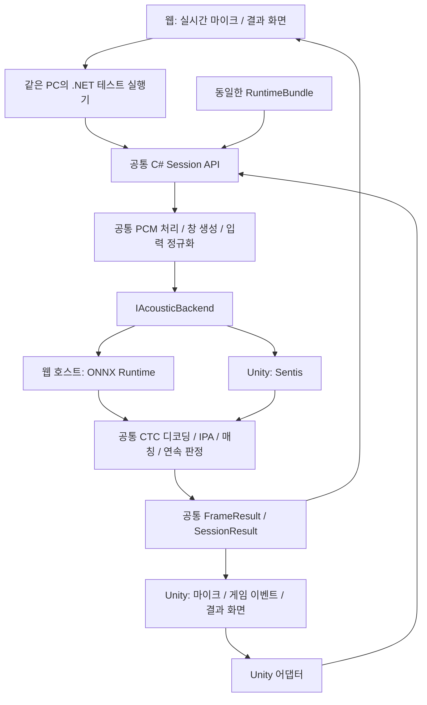

# 웹·Unity 공통 실행 모듈 설계

상태: 웹 호스트·공유 번들 통합 설계 초안. 기존 C# `PronunciationSession`과
`AudioWindowBuffer`는 구현되어 있다. 실시간 전용 UI와 확정 결과 계약도 구현했다.
아래의 새로운 호스트·번들 API·파일 배치는 제안이며 기존 Session API와 구분한다.
기준: 아동 파인튜닝·음절 피드백을 포함한 `f2d05ba`에 이번 확정 결과 통합을 반영, 2026-09-06.

목표는 웹에서 검증한 판정 로직, 설정, 정답 데이터, 결과 형식을 Unity에서 다시 작성하지 않고 사용하는 것이다. 웹의 실시간 탭을 Unity와 같은 세션 API를 사용하는 테스트 클라이언트로 만들고, 자동 회귀 테스트의 파일 재생도 같은 세션을 통과시킨다. Unity는 기존처럼 기기 안에서 실행하며, 웹 서버로 음성을 보내는 기능을 추가하지 않는다.

## 1. 현재의 API와 실행 방식

Unity에는 이미 **로컬 C# API**가 있다. 게임이 `PronunciationListener.Listen()`을 호출하면 같은 프로세스에서 마이크를 읽고 `SentisPhonemeRecognizer`가 추론한다. 결과는 `OnFrameScored`, `OnConfirmedDetailed`, `OnConfirmed`, `OnTimedOut` 이벤트로 받는다. 이 저장소의 Unity 런타임에는 웹 서버에 음성을 보내는 HTTP/WebSocket 클라이언트가 없다.

웹의 Gradio 앱은 Python ASR·매처를 실행한다. 따라서 현재의 웹은 Unity API를 호출하는 클라이언트가 아니다.

실시간 화면에 확정 프레임의 한글 설명과 접힌 상세 IPA 비교를 추가했고, 양쪽에 `PronunciationFeedback` 버전 2 데이터 계약을 구현했다. Unity의 `OnConfirmedDetailed`, `LastConfirmation`, `StreamingHit.Feedback`이 이를 제공한다. `KoreanFeedback.Items[].Message`는 UI에 바로 표시할 문장이다. [구현된 피드백 API](../unity/Packages/com.domicube.phoneme-matching/Documentation~/pronunciation-feedback.md)는 아래의 전체 공통 세션 API 제안과 구분한다. 이 변경만으로 추론·프레임 생성까지 통합된 것은 아니다.

현재 설명 로직은 Python/C# 각각의 구현이며 공통 벡터로 일치를 검사한다. 웹 HTML만 고치면 Unity의 표시 화면이 바뀌는 구조도, Python 설명 규칙만 고치면 C#에 자동 반영되는 구조도 아니다. 전체 통합 전에는 양쪽 설명 규칙을 함께 수정·검증해야 한다.

| 영역 | 현재 웹 | 현재 Unity | 통합 시 처리 |
|---|---|---|---|
| 추론 | Python PyTorch | C# Sentis | 같은 ONNX 모델과 공통 입출력 계약 |
| 인식 한글 → IPA | Python 한국어 규칙 + 매핑 | C# Korean.Rules + JamoIpa | 동일 구현을 공통 C# 후처리로 재사용 |
| 매칭·연속 확정 | Python 구현 | C# 구현 | 같은 C# 소스 직접 사용 |
| 실시간 프레임 | 브라우저 청크가 올 때마다 채점 | 코루틴에서 마이크 창을 채점 | 공통 샘플 기준 프레임 생성 |
| 설정 | 실시간 화면 슬라이더·상수 | Inspector·씬 직렬화 값 | 공통 프로필 + 세션 시작 시 확정된 설정 |
| 후보 | 입력 단어 즉석 생성·측정 임계값 | TargetWords / Session.Begin에 넘긴 허용 정답만 | 명시적인 후보 ID·허용 정답 ID |
| 확정 결과 | `PronunciationFeedback` dict·한글 설명·IPA 표 | 같은 계약의 C# DTO·상세 이벤트·스냅샷 | 구현된 계약을 공통 SessionResult에 연결 |
| 발음 설명 | Python 규칙, `korean_feedback` | C# 규칙, `KoreanFeedback` | 공통 C# 설명 규칙 직접 사용 |
| 데이터 생성 | 실시간 후보 즉석 생성, 정식 빌드는 CLI | ID·음소·단어별 임계값이 있는 flat answers 카탈로그 | 동일한 배포용 번들 생성 |
| 저장 | 웹 저장 화면 없음 | 기본 Listener에는 저장 기능 없음 | 필요 시 공통 세션 결과를 테스트 도구에서 보관 |

근거 파일:

- [웹의 실시간 처리](../python/tools/web_test.py)
- [Python 한국어 ASR](../python/runtime/recognizer/ko/asr.py)
- [정답 빌드 도구](../python/build/build_targets.py)
- [Unity Listener](../unity/Packages/com.domicube.phoneme-matching/Runtime/Unity/PronunciationListener.cs)
- [Unity Sentis 인식기](../unity/Packages/com.domicube.phoneme-matching/Runtime/Unity/SentisPhonemeRecognizer.cs)
- [Unity TestBench](../unity/Assets/Scripts/PronunciationTestBench.cs)

## 2. 같은 로컬 C# API를 사용하는 두 실행 환경

기존 [패키지](../unity/Packages/com.domicube.phoneme-matching/package.json)의 온디바이스 실행을 유지한다. 공유할 대상은 C# 소스와 설정·데이터다. 각 환경이 자신의 프로세스 안에서 공통 코어를 실행한다.

| 환경 | 호출 방식 | 음성 처리 위치 |
|---|---|---|
| Unity 게임 | 패키지의 C# Session API 직접 호출 | 게임을 실행하는 기기 |
| 웹 테스트 도구 | Gradio 어댑터 → 같은 PC의 .NET 테스트 실행기 → 같은 Session API | 테스트 도구를 실행하는 PC |

웹 테스트의 로컬 실행기는 Python UI와 C# 라이브러리 사이를 연결하는 개발 도구다. Unity는 이 실행기나 웹페이지가 켜져 있지 않아도 동작한다. 브라우저의 녹음을 Gradio 프로세스가 받는 기존 경로와, Unity 게임의 실행 경로를 구분한다. Unity에서 HTTP/WebSocket으로 음성을 보내는 통신은 이 설계에 필요하지 않다.

## 3. 모듈 구조



그림의 공통 노드는 같은 소스 코드의 소유권을 나타낸다. 웹과 Unity는 각각 자신의 프로세스와 세션 인스턴스를 가지며, 같은 실행 인스턴스를 네트워크로 공유한다는 의미는 아니다.

공통 코어는 기존 UPM 패키지 `Runtime/` 안에 둔다. .NET 프로젝트는 이 소스를 링크해 컴파일한다. 이미 [C# 테스트 프로젝트](../csharp/PhonemeMatching.Tests/PhonemeMatching.Tests.csproj)가 같은 방식을 사용하고 있다. 복사한 C# 파일이나 별도의 Python 판정 구현을 공통 코어로 취급하지 않는다.

제안하는 추가 구조:

```text
unity/Packages/com.domicube.phoneme-matching/
  Runtime/
    Session/          SessionRequest, RuntimeProfile, Session, 결과 DTO
    Audio/            상태 유지 리샘플러, 롤링 버퍼, 프레임 생성, 입력 정규화
    Inference/        IAcousticBackend, Logits, 공통 인식 파이프라인
    Matcher.cs        기존 매칭 로직
    StreamingMatcher.cs
    PronunciationFeedback.cs  기존 확정 결과 계약 유지
    CtcDecoder.cs
    Korean/JamoIpa.cs
    Korean/KoreanFeedbackBuilder.cs  기존 한글 설명 규칙 재사용
    Unity/            마이크 장치, Sentis 백엔드, Listener
  Editor/             개발용 번들 동기화·빌드 검증
csharp/
  PhonemeMatching.Core/       Runtime/ 공통 소스를 링크하는 class library
  PhonemeMatching.Host/       로컬 통신·ONNX Runtime·세션 수명 관리
  PhonemeMatching.Tests/
python/
  tools/web_test.py           입력·설정 편집·결과 표시
  tools/runtime_client.py     호스트 통신만 담당
  build/                     g2pkk·모델 export·번들 작성 도구
shared/runtime/
  current.json               현재 활성 번들 ID
  bundles/<bundle-id>/       검증된 불변 데이터 묶음
```

코어는 UnityEngine, Gradio, PyTorch, ONNX Runtime에 의존하지 않는다. `netstandard2.1`과 Unity에서 지원하는 C# 9 범위로 컴파일하며, 호스트의 .NET 10 API가 코어에 들어가지 않도록 분리한다. Unity의 공식 지원 범위는 [.NET API 호환성](https://docs.unity3d.com/6000.3/Documentation/Manual/dotnet-profile-support.html)과 [C# 컴파일러 문서](https://docs.unity3d.com/6000.3/Documentation/Manual/csharp-compiler.html)를 기준으로 한다. Unity 직렬화용 DTO는 일반 클래스와 필드를 사용한다.

웹 호스트에서는 [ONNX Runtime의 C# API](https://onnxruntime.ai/docs/get-started/with-csharp.html)를 사용하는 백엔드를 둔다. ONNX Runtime/Sentis별 코드는 정규화된 입력 텐서를 logits로 바꾸는 일만 맡는다. 현재 Sentis 인식기에 들어 있는 입력 정규화, CTC 디코딩, IPA 변환을 공통 파이프라인으로 옮긴다.

한국어 정답 빌드에는 Python의 `KoreanG2P.apply_rules()`를 사용한다. 통합 시에는 현재
Unity의 `Rules.Apply → JamoIpa` 경로를 공통 코어에서 재사용하며, 음운 규칙을 생략하지 않는다.

초기 호스트 통신은 Gradio 프로세스가 관리하는 로컬 자식 프로세스의 JSON Lines로 충분하다. `request_id`, `session_id`, `protocol_version`을 포함하고, PCM은 sample rate·channels와 함께 float32 little-endian 바이트를 전달한다. JSON 전송 시 바이트는 base64로 표현한다. 브라우저가 .NET DLL을 직접 호출하는 구조는 아니다.

호스트는 한 번 로드한 모델을 재사용하고 세션별로 버퍼·판정 상태를 분리한다. 표준 출력은 응답 전용, 로그는 표준 오류로 분리한다. 세션별 요청 순서, 취소, 응답 대기 시간, 호스트 종료 시 오류 전달을 통신 계층에서 처리한다. Unity 빌드에는 이 로컬 호스트가 필요 없다.

## 4. 공통 사용 계약

웹과 Unity는 다음과 같은 수명 주기를 사용한다. 아래 이름은 제안 API이며 아직 구현되어 있지 않다.

```text
LoadBundle(bundleId)
CreateSession(request) → sessionId + effectiveProfile + bundleIdentity
AppendAudio(sessionId, pcmChunk) → 0개 이상의 FrameResult / SessionResult
AdvanceClock(sessionId, elapsedSeconds) → 시간 제한 확인
EndInput(sessionId) → 입력 종료 결과
Cancel(sessionId) → 사용자 중단 결과
```

`SessionRequest`에는 다음을 명시한다.

| 필드 | 의미 |
|---|---|
| `candidate_ids` | 비교할 후보 목록. 순서도 고정해 동점 처리 재현 |
| `accepted_answer_ids` | 후보 중 확정해도 되는 정답 목록. 생략하면 후보 전체 허용 |
| `profile_id` | 창 길이·hop·확정 횟수·시간 제한·매칭 설정 |
| `bundle_id` | 사용한 정답·혼동행렬·모델·어휘 묶음 |
| `diagnostics` | 후보별 점수·alignment·프레임 기록 수집 수준 |

UI는 단어를 ID로 선택하게 돕는다. 세그먼트 전체를 대상으로 테스트할 때도 실제 후보 ID 목록을 표시하고 요청에 넣는다. 존재하지 않는 ID, 빈 후보, 후보에 포함되지 않는 허용 정답, 언어·모델 불일치는 시작 전에 오류로 처리한다.

`FrameResult`는 한 번의 채점 결과이며 다음을 포함한다.

- 세션 ID, 채점 번호, 오디오 창의 시작/끝 sample index와 시간.
- 인식 한글, 사용자 IPA, 채점에 포함된 IPA 범위.
- 최고 후보의 ID·텍스트·정답 IPA·score·distance·threshold·alignment.
- `frame_passed`, `is_accepted_answer`, 현재 streak, 확정에 필요한 횟수.
- 요청한 경우 후보별 점수, 추론 시간, 입력 장치·백엔드 정보.

한 프레임에서 후보별 점수를 한 번만 계산하고, 그 결과를 연속 판정·화면·저장이 함께 사용한다. 디버그 화면용으로 매칭을 다시 실행하지 않는다.

`SessionResult`에는 종료 사유(`confirmed`, `timed_out`, `cancelled`, `input_ended`, `error`), 마지막 프레임, 확정된 답안, 총 채점 횟수, 연속 횟수, 오디오 기준 확정 시각, 실제 경과 시간, 번들/코어/프로필 버전을 포함한다. 확정 점수는 마지막 확정 프레임의 score로 정의하고, 평균 등은 별도 필드로 제공한다.

이미 제공 중인 `PronunciationFeedback`의 IPA 정렬·한글 설명·인덱스 의미를 보존한다. 설명은 확정 프레임의 정렬을 재사용하고, 화면을 위해 별도 ASR이나 새 정렬을 수행하지 않는다.

`Alignment`의 인덱스는 음소 인덱스다. 해당 음소의 실제 발음 시작/끝 시간을 의미하지 않는다. 오디오 창 시각은 제공할 수 있지만 음소별 시간 정렬은 별도의 기능이다. 점수는 ASR 음소열 사이의 가중 유사도이며 실제 발음 정확도 퍼센트로 정의하지 않는다.

## 5. 실시간·파일 재생의 동일성

공통 세션이 PCM 수신부터 프레임 생성까지 소유해야 브라우저 청크 크기나 Unity 프레임 속도가 정답 판정을 바꾸지 않는다.

1. 입력은 원본 sample rate·channels·연속 sample index가 있는 PCM 청크다. 각 플랫폼은 파일 디코딩과 장치 접근을 담당한다.
2. downmix·리샘플링은 같은 코어에서 수행하고, 리샘플러의 위상을 청크 사이에 유지한다.
3. 정규화된 16kHz 샘플 개수로 hop을 센다. 같은 PCM을 다른 크기의 청크로 나눠 보내도 동일한 오디오 창이 생성되어야 한다.
4. 첫 채점은 완성된 첫 hop에서 한다. 모델이 허용하는 최소 입력 길이보다 짧은 hop은 프로필 검증에서 거부한다.
5. 한 청크에 여러 hop이 들어오면 순서대로 각각 채점한다. 웹 콜백 1회를 무조건 채점 1회로 계산하지 않는다.
6. 입력이 끝났을 때 남은 부분 hop이나 동일한 마지막 창으로 streak를 추가하지 않는다. 무음을 덧붙여 테스트하려면 테스트 입력 자체에 명시적으로 포함한다.
7. 임계값을 넘은 같은 최고 후보만 streak를 증가시킨다. 후보 변경·미달·누락된 오디오 구간에서 연속 상태를 끊는다.
8. streak를 채운 후보가 허용 정답에 포함되면 정확히 한 번 확정한다. 허용되지 않는 후보의 검출은 프레임에 기록하고 청취를 계속한다.
9. 확정·취소·시간 초과·오류로 종료된 세션은 이후 PCM을 채점하지 않는다. 늦게 도착한 응답도 세션 ID로 걸러낸다.

웹의 `stream_every`와 Unity 코루틴 주기는 PCM을 전달하는 빈도다. 실제 채점 hop은 공통 프로필에만 둔다. 과부하 시 누락을 숨겨 연속 통과로 계산하지 않고, 처리 지연 또는 오디오 gap을 결과에 기록한다. 큐 용량은 제한하고 넘치면 명시적으로 오류 종료한다.

프레임 시각은 오디오 sample index로 계산한다. 청취 시간 제한은 시작 후 단조 증가하는 clock을 입력받아 계산한다. 파일 재생 테스트는 기록된 clock 또는 오디오 시각을 사용하고 어떤 clock을 사용했는지 결과에 남긴다. 실제 추론 시간과 오디오 기준 판정 시각은 별도로 기록한다.

모델 예열은 청취 세션 전에 수행하며 채점 번호나 streak를 증가시키지 않는다. 설정은 세션 시작 때 고정한다. 창 길이·연속 횟수 등을 변경한 경우 새 세션으로 시작한다.

## 6. 실시간 전용 웹 테스트 화면

웹은 Unity의 청취 흐름만 테스트하는 단일 화면으로 제한한다. 별도의 발음 테스트·녹음 재생·ASR 단독·정답 데이터 생성 탭은 두지 않는다. 이 UI 정리는 적용했지만, 공통 C# API 연결은 다음 단계다.

| 실시간 화면 기능 | 공통 API 사용 | Unity와의 관계 |
|---|---|---|
| 정답·설정 입력 | 후보 목록과 프로필로 `SessionRequest` 구성 | 게임이 넘기는 세션 요청과 같은 계약 |
| 준비 | 번들·모델 로드 및 예열 | 청취 전에 수행, streak에 포함하지 않음 |
| 마이크 시작·입력 | `CreateSession` + `AppendAudio` | Unity 마이크와 같은 상태 전이·판정 |
| 확정·중단·재시작 | 종료 결과 수신, 캡처 종료, 새 세션 | 같은 종료 사유·초기화 규칙 |
| 점수 그래프·IPA·프레임 표 | 공통 결과 객체를 표시 | UI에 판정식을 다시 구현하지 않음 |
| 확정 발음 설명·상세 IPA 표 | 기존 피드백 계약을 SessionResult에서 전달 | Unity도 `Message`를 표시하고 필요하면 상세 필드를 사용 |

파일 재생은 웹의 별도 사용자 모드가 아니라 CLI/자동 회귀 테스트에서 같은 세션에 PCM을 공급하는 방법으로 남긴다. 정답 데이터 빌드는 기존 빌드 도구가 담당한다. 웹 통합을 위해 별도의 배치 판정 API나 ASR 단독 API를 추가할 필요는 없다.

단어를 즉석 입력하는 편의 기능은 빌드 API로 임시 번들을 만든 후 그 번들을 세션에 넣는다. 정식 번들에 없는 단어를 웹만 알고 있는 상태로 테스트하지 않는다. 임시 번들은 초안으로 표시하고, 공유 저장 전까지 Unity 기본 데이터로 활성화하지 않는다.

## 7. 설정과 데이터의 자동 반영

`RuntimeBundle`은 `manifest.json`, `profiles.json`, `targets.json`, `matrix.json`, `vocab.json`과 모델 참조를 묶는다. 큰 ONNX 파일은 별도 캐시에 두되 manifest에 정확한 파일 hash를 기록한다. 모델 교체 시에는 모델을 다시 export/import하고 새 번들의 검증을 수행해야 한다.

manifest에는 스키마 버전, 번들 ID, 요구 코어 버전, 언어/음소 매핑 버전, 각 파일 hash, ONNX hash를 포함한다. 세션은 이 묶음을 시작 때 스냅샷으로 고정한다. 결과에도 동일한 식별자를 기록한다.

기존의 `streaming_profile` 설정은 공통 프로필로 이관하고 혼동행렬은 음소 비용 데이터로 집중시킨다. 창 길이·hop·consecutive·시간 제한은 프로필에 한 번만 정의한다. 2회 또는 3회 확정 모두 같은 프로필의 `consecutive`로 결정한다. 이번 설계 단계에서는 현재 저장된 기본값을 변경하지 않는다.

설정 적용 흐름:

```text
웹에서 프로필/정답 편집
  → 임시 번들로 테스트
  → '공유 설정으로 저장'
  → 검증된 새 번들 생성
  → current.json 활성 번들 교체
  → 웹과 Unity의 다음 세션이 같은 번들을 읽음
```

여러 파일을 실행 중 하나씩 덮어쓰지 않는다. 새 번들 생성과 검증이 끝난 뒤 활성 참조를 교체한다. 실행 중인 세션은 기존 번들을 끝까지 사용한다.

개발 중 웹과 Unity Editor는 같은 bundle root를 참조한다. 실제 게임 프로젝트가 다른 저장소라면 로컬 UPM 참조와 bundle root를 최초 한 번 연결한다. 패키지 경로·모델 경로는 환경별 배치 정보로 관리하고 판정 프로필과 분리한다.

Unity 빌드 시 Editor 단계가 선택된 번들을 자동으로 포함하고, 코드·모델·데이터 호환성을 검증한다. 현재처럼 세 곳의 JSON을 사람이 복사해서 관리하지 않는다. Inspector의 개별 숫자는 공유 프로필을 가리는 숨은 override가 되지 않도록 이관한다. 개발용 override가 필요한 경우 명시적으로 켜고 실제 사용 설정을 양쪽 화면에 표시한다.

| 변경 | 별도의 Unity 판정 코드 수정 | 필요한 적용 작업 |
|---|---|---|
| 점수 비용·threshold·consecutive | 없음 | 새 번들을 다음 세션에 로드 |
| 후보·정답 단어 | 없음 | 빌드한 번들 활성화 |
| 공통 매칭·세션 로직 | 없음 | 호스트와 Unity가 동일 소스를 재컴파일 |
| ONNX 모델 | 공통 계약을 유지하면 없음 | 모델 배포·Sentis import·호환성 검증 |
| Unity 화면에 새 표시 추가 | 표시 코드 작업 필요 | 공유 결과 필드를 화면에 연결 |
| 기존 배포 게임 업데이트 | 재구현은 불필요 | 패키지/데이터 업데이트 또는 게임 재빌드 |

Git 태그에 고정된 UPM 패키지는 로컬 수정이 자동으로 반영되는 참조가 아니다. 이 설계의 '바로 적용'은 같은 개발 소스·번들을 공유하는 환경에서의 재컴파일/재로드를 뜻한다. 이미 빌드된 오프라인 게임의 코드가 자동으로 바뀐다는 뜻은 아니다.

## 8. Unity 연결 API의 호환성

새 Listener는 공통 세션 생성·PCM 전달·이벤트 중계·마이크 종료만 담당한다. 기본 Demo와 TestBench도 같은 Listener/Session을 사용하며 각자 후보 판정 루프를 갖지 않는다.

- 상세 이벤트: `OnFrameResult(FrameResult)`, `OnSessionEnded(SessionResult)`.
- 기존 `OnConfirmed(string, float)`는 상세 결과에서 파생해 유지할 수 있다.
- 기존 `OnFrameScored(string, float, int)`도 같은 프레임 결과에서 파생한다.
- 시간 초과와 실행 오류를 서로 다른 종료 사유로 제공한다.
- 중단 후 버퍼·모델 자원 해제와 이벤트 호출은 서로 중복되지 않도록 수명을 관리한다.

현재의 `TargetWords`와 `Session.Begin`은 이미 명시적인 허용 정답 목록을 받는다.
통합 때에도 그 목록을 그대로 유지하며 세그먼트 전체로 확장하지 않는다.

## 9. 검증 기준과 전환 순서

같은 모델 파일을 사용해도 ONNX Runtime과 Sentis의 연산 결과가 완전히 같다는 보장은 없다. 공통 코드로 보장하는 범위와 추론 백엔드를 실제 실행해 확인하는 범위를 나눈다.

| 검증 | 통과 기준 |
|---|---|
| 동일 IPA·설정 입력 | 공통 코어의 후보·거리·alignment·확정 프레임 일치 |
| 동일 logits 입력 | 공통 CTC 결과와 IPA 일치 |
| 동일 PCM, 다른 청크 분할 | 리샘플링·오디오 창·채점 수·프레임 결과 일치 |
| 같은 번들로 파일 재생 | 후보·프로필·모델·어휘 식별자 일치 |
| ONNX Runtime ↔ Sentis | 지정 회귀 음성의 토큰·IPA·확정 결과 비교, 차이 보고 |
| 취소·타임아웃·오류·재시작 | 종료 이벤트 정확히 1회, 이전 세션 결과 혼입 없음 |
| 번들 변경 | 새 세션만 새 버전 사용, 잘못된 묶음은 시작 전에 거부 |
| 결과 표시 | 화면의 확정 단어·점수·프레임이 공통 세션 결과와 일치 |

현재의 Python 기준 벡터는 기존 동작을 보존하는 회귀 자료로 유지한다. 이후 공통 로직 변경 때 Python 매처도 함께 수정해 기대값을 맞추는 절차는 없앤다. 공통 코어 단위 테스트·전송 계약 테스트·Unity PlayMode/실제 Sentis 테스트를 각 경계에 둔다. .NET 테스트 통과만으로 Unity 엔진 코드가 검증됐다고 표시하지 않는다.

실제 브라우저와 헤드셋 마이크는 잡음 억제·자동 게인 등 입력 특성이 다를 수 있다. 논리 일치는 동일 PCM 재생으로 검증하고 실제 장치 시험에는 장치와 캡처 설정을 함께 기록한다. 웹의 처리 시간은 Unity GPU 성능의 대용 지표로 사용하지 않는다.

전환은 다음 순서로 한다.

1. **계약·설정 통일:** SessionRequest/Result와 번들 스키마를 확정하고 현재 씬·실시간 화면 설정을 명시적으로 이관한다.
2. **공통 C# 세션:** 후보·매칭·streak·종료 상태를 한 모듈에 모으고 Unity Listener와 TestBench를 연결한다.
3. **공통 오디오·후처리:** 리샘플링·창 생성·정규화·CTC·IPA를 공유하고 Sentis는 logits 백엔드로 줄인다.
4. **웹 연결:** .NET 호스트와 ONNX Runtime 백엔드를 추가하고 실시간 웹 UI를 동일 API에 연결한다. 파일 PCM 재생은 자동 회귀 테스트에만 둔다.
5. **빌드·저장 통일:** 정답 생성과 모델 export를 같은 번들로 묶고 공유 저장·Unity 자동 포함을 연결한다.
6. **전환 검증:** 같은 PCM/번들로 양쪽을 재생하고 기존 Python 실행 경로를 웹의 기본 경로에서 제거한다.

완료 조건은 '웹 테스트에 사용한 세션 입력·설정·코어·결과 계약을 Unity가 그대로 사용한다'이다. 위 중 일부 단계만 끝난 상태는 전체 통합 완료로 취급하지 않는다.

## 10. 구현·검증 상태 (2026-09-06)

- 현재 Unity 런타임의 API는 로컬 C# 호출이며 서버 호출 경로는 확인되지 않았다.
- 공통 코어 소스를 Unity 외부 .NET 프로젝트에서 직접 컴파일하는 기반이 이미 있다.
- Python 170개, .NET C# 28개, Unity 6000.3.18f1 PlayMode 29개 통과. Session·Listener의 확정 스냅샷과 이벤트 순서도 검사한다.
- 웹 UI는 실시간 마이크 단일 화면으로 정리했다. 정답 카탈로그 사전 빌드 없이 실행할 수 있고, 기존 CLI는 유지했다.
- 기본 한국어 처리는 이미 포팅된 mecab-free 규칙을 유지한다. g2pkk 비교용 MeCab 어댑터만 교체했다.
- 확정 결과 계약과 한글 설명을 양쪽에 구현했다. 공유 JSON 계약 벡터, 24개 설명 사례, 전체 한글 음절 매핑으로 대조한다. 웹 모델 예열과 합성 확정 결과 HTML/JSON을 확인했다.
- 새 설명 기능의 실제 마이크 발화 평가는 별도다. 같은 PCM을 웹·Unity 전체 파이프라인에 넣는 통합 회귀 테스트를 완료한 것은 아니다.
- 기존 C# Session은 `frame.Feedback` / `LastConfirmation`을 제공한다. 웹의 C# 호스트 연결·공유 번들·전체 PCM 경로 통합은 아직 미구현이다.
- 기존 모델 오류표 기반 판단 보류는 Python의 화면 정책으로 보존했다. 공통 JSON/C# DTO는 원본 차이를 유지하며 그 정책까지 같은 구현이라고 주장하지 않는다.
